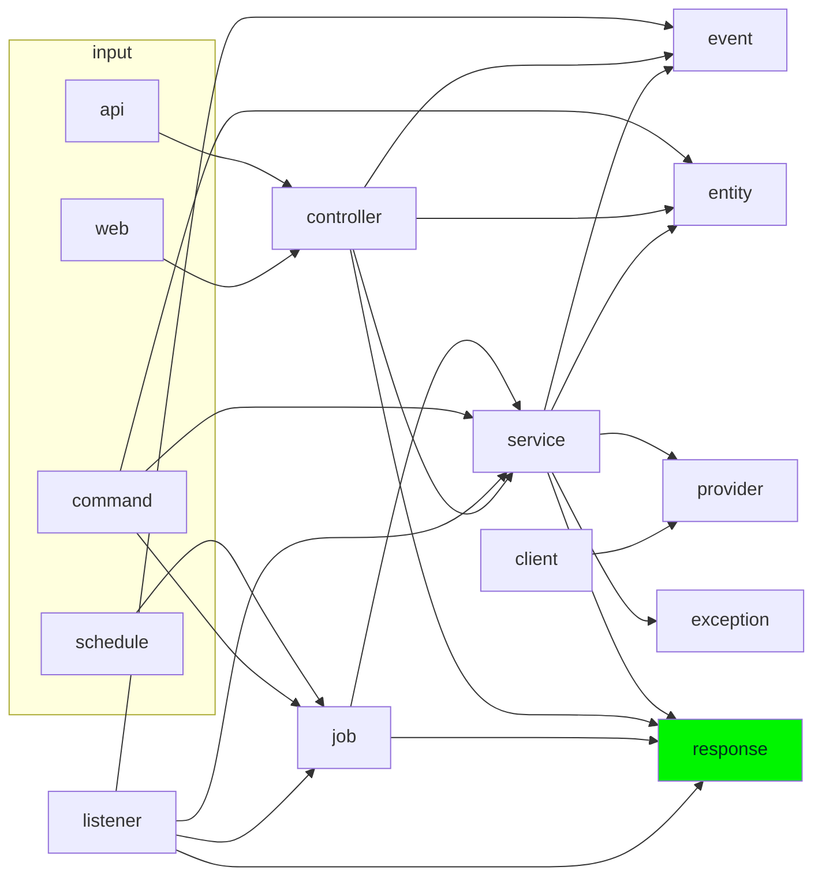

# Contribuindo

Encontrou um erro? Quer conversar/sugerir uma nova funcionalidade? Pode enviar uma *issue* ou *Pull Request* (PR) com a sugestão.

> Créditos do documento ao time do [Angular](https://github.com/angular/angular/blob/master/CONTRIBUTING.md).

## Enviando uma issue

Lembre de explicar o cenário do bug/feature.

## Enviando um PR

1. *Forke* o projeto.
2. Clone o projeto *forkado*:
```sh
git clone <url-do-projeto-forkado>
```

3. Adicione o *upstream*:
```sh
git remote add upstream <url-do-projeto-original>
```

4. Crie uma nova branch:
```sh
git checkout -b my-fix-branch
```

5. Ao final do desenvolvimento, atualize sua branch de acordo com o *upstream*. Corrija conflitos se necessário.
```sh
git pull upstream main
```

> Os commits serão *squashados*, então não se preocupe em utilizar `rebase`

6. Envie seu código para o *remote*:
```sh
git push origin HEAD
```

7. Abra o PR para `main`.
    - Se forem sugeridas mudanças na revisão do PR então:
        1. Faça-as.
        2. Atualize novamente sua branch: ``git pull upstream main``
        3. Atualize novamente seu *fork* (isso atualizará o PR): ``git push origin HEAD``

### Após PR concluído

Caso queira manter o projeto para futuras contribuições, pode deletar somente sua branch e baixar as mudanças do projeto:

1. Trocar para a branch principal:
```sh
git checkout main
```

2. Deletar a branch local:
```sh
git branch -D my-fix-branch
```

3. Deletar a branch do repositório remoto:
```sh
git push origin --delete my-fix-branch
```

4. Atualizar a branch principal:
```sh
git fetch --all
git reset --hard upstream/main
```

## Desenvolvimento

### Arquitetura Backend



#### Testabilidade

- *Unit*: Classes sem dependências. Exemplo: `Exceptions`, `Enums`, `Notifications` e classes específicas de bibliotecas como `Exports`
- *Integration*: Classes cujo possuem dependências. Exemplo: `Services`, `Clients`, `Providers`, `Jobs`, `Events`/`Hooks` e `Listeners`/`Subscribers`
- *Feature*: Fluxos que iniciam a partir do usuário. Exemplo: chamada de API, acesso web, comandos e agendamentos

#### Scope

É importante adicionar escopo as models por padrão, situações em que elas não são necessárias são consideradas exceções.

## Dicas

- Utilize `localhost:8025` para ver os e-mail enviados

### CLI

```sh
# containers
sail build --no-cache
sail up
sail up --build
sail bash
sail down
sail down --rmi all -v
```

```sh
# scaffolding
sail artisan list
sail artisan make -h
sail artisan make:migration -h
sail artisan make:controller -h
sail artisan make:request -h
sail artisan make:resource -h
sail artisan make:test -h
sail artisan make:model -h
sail artisan make:factory -h
sail artisan make:exception -h
sail artisan make:command -h
sail artisan make:job -h
```

```sh
# backend
sail test
sail test --filter <FileName>
sail composer format
```

```sh
# frontend
sail npm start
sail npm test
sail npm test <FileName>
sail npm format
sail artisan ziggy:generate
```

### Makefile como `meumakefile`

- exemplo: `make -f meumakefile up`

```Makefile
# vim:set ff=unix ts=4 ss=4 sw=4 sta noet:
# nofixendofline
#%s/^[ ]\+/\t/g

i:
	./vendor/bin/sail composer i

u:
	./vendor/bin/sail composer update

o:
	./vendor/bin/sail artisan optimize:clear

ide:
	./vendor/bin/sail composer ide

up:
	./vendor/bin/sail up -d

review:
	./vendor/bin/sail composer i
	./vendor/bin/sail artisan optimize:clear
	./vendor/bin/sail artisan migrate:fresh --seed

down:
	./vendor/bin/sail down

migrate:
	./vendor/bin/sail artisan migrate:fresh --seed

test:
	./vendor/bin/sail test --parallel --no-coverage

test-%:
	for number in `seq $*`; do bash -c './vendor/bin/sail test --parallel --no-coverage --stop-on-failure' || true; done

testf-%:
	for number in `seq 10`; do bash -c './vendor/bin/sail test --no-coverage --filter $*' || true; done

pint:
	./vendor/bin/sail php ./vendor/bin/pint

stan:
	./vendor/bin/sail composer analyse

ci:
	./vendor/bin/sail test --parallel --no-coverage --stop-on-failure
	./vendor/bin/sail php ./vendor/bin/pint
	./vendor/bin/sail composer analyse

setting-%:
	./vendor/bin/sail artisan tinker --execute='\App\Models\Setting::updateOrCreate(["key" => "$*"], ["value" => 0])'

vite:
	./vendor/bin/sail npm run start

vitest:
	./vendor/bin/sail npm test

fmt:
	./vendor/bin/sail npm run format
```

